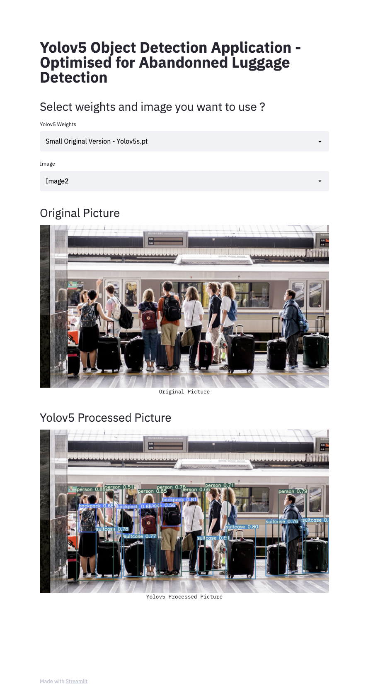

# Yolov5 Object Detection Application 

This application is a non-exhaustive version of what is possible to do with yolov5 object detection. It is only a demo of a surveillance tool.
A step which is not detailled in this project consisted in training weights on custom dataset with low quality luggage pictures in order to improve robustness in detection. For this, I used Google Colab. 

### Step 1 : Clone et install requirements
```bash
pip install - r requirements.txt
```

### Step 2 : Launch streamlit application 
```bash
streamlit run app.py
```

### Step 3 : Select weights and image you want to use

