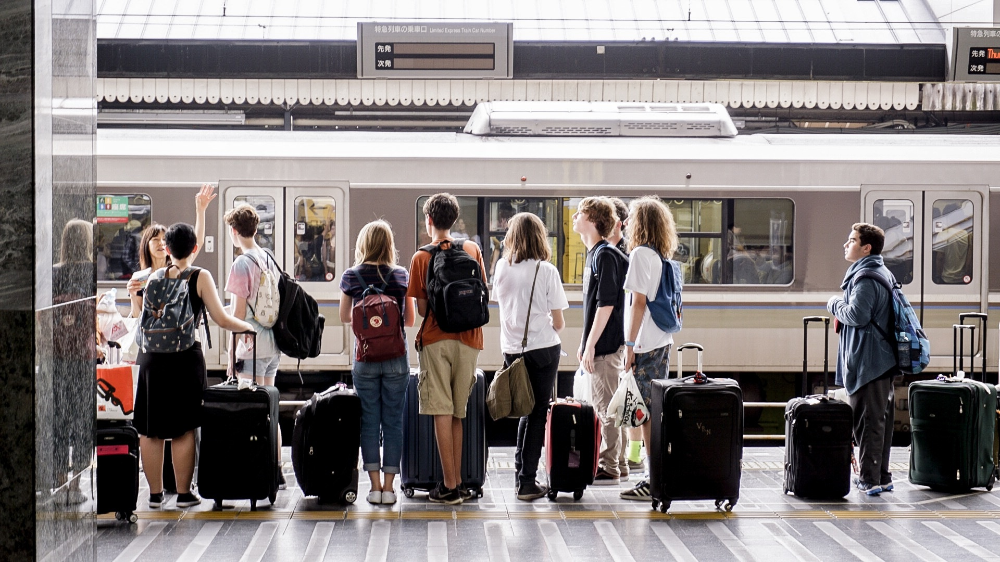

## Yolov5 Object Detection Application 

This application is a non-exhaustive version of what is possible to do with yolov5 object detection. It is only a demo of a surveillance tool.

# Step 1 : Clone et install requirements
```bash
pip install - r requirements.txt
```

# Step 2 : Launch streamlit application 
```bash
streamlit run app.py
```

# Step 3 : Select weights and image you want to use

